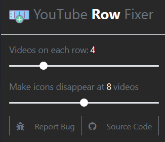

# YouTube row fixer

This is an extension that fixes the new ugly youtube layout (big thumbnails) 
and lets you set the amount of videos on a row yourself.

> note: this has only been tested on firefox but should in theory work on chrome

 

this extension was created because YouTube decided to update their layout by only allowing 4 videos on one row.  
YouTube has no option to change this yourself (not at the time of creating this) so we've set to work.

 
